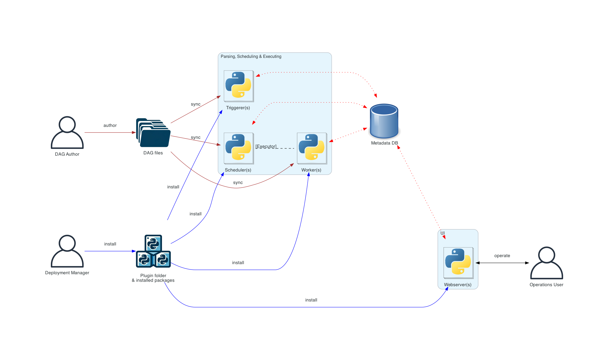
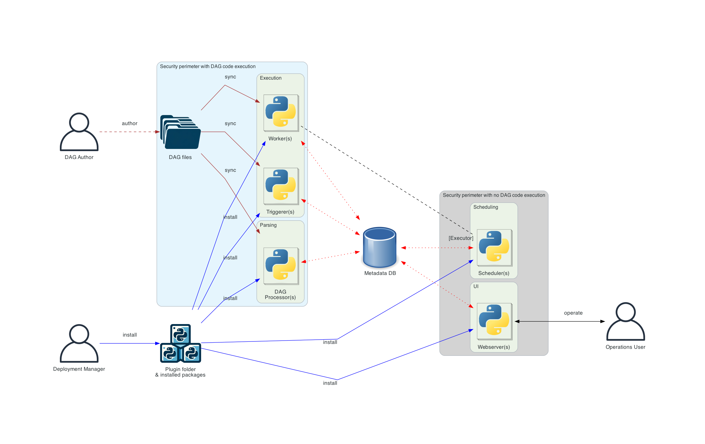

# Airflow introduction

The official doc can be found [here](https://airflow.apache.org/docs/apache-airflow/stable/index.html)

`Apache Airflow` is an open-source platform for developing, scheduling, and monitoring batch-oriented workflows. 
Airflow’s extensible Python framework enables you to build workflows connecting with virtually any technology. 
A web interface helps manage the state of your workflows. Airflow is deployable in many ways, varying from a single 
process on your laptop to a distributed setup to support even the biggest workflows.

The main characteristic of Airflow workflows is that all workflows are defined in `Python code`. “Workflows as code” serves several purposes:

- Dynamic: Airflow pipelines are configured as Python code, allowing for dynamic pipeline generation.

- Extensible: The Airflow framework contains `operators` to connect with numerous technologies. All Airflow components are extensible to easily adjust to your environment.

- Flexible: Workflow parameterization is built-in leveraging the `Jinja templating engine`.

## 1. Core concepts

The core concepts of workflow framework is universal, such as:

- DAGs: Directed Acyclic Graph is a collection on interconnected `tasks`. The graphe has a unique direction without loop inside.
- Tasks: is a script(bash, python, sql, etc.) which fetches data, runs analysis, triggers other systems, or more

The airflow specific concepts:
- Operators: An Operator is conceptually a template for a predefined Task, that you can just define declaratively inside your DAG.
           For example, `BashOperator` executes a bash command. `PythonOperator` runs python codes, ETc.
- Sensors: Sensors are a `special type of Operator` that are designed to do exactly one thing - wait for something to 
           occur. It can be `time-based, or waiting for a file, or an external event`, but all they do is wait 
            until something happens, and then succeed so their downstream tasks can run.
- TaskFlow: Use `@task decorator` to make plain python code(rather than Operators) DAGs more clean to read.
- Executor: Executors are the mechanism by which `task instances` get run. There are standalone executor such as `Local/Sequential executor`,
            There are also cluster executor such as `Celery/k8s executor`
- XComs: `XComs (short for “cross-communications”)` are a mechanism that let Tasks talk to each other, as by 
          default Tasks are entirely isolated and may be running on entirely different machines.

Here I only list the concepts that you need to understand the airflow pipeline. For more details,
You can find all airflow concepts [here](https://airflow.apache.org/docs/apache-airflow/stable/core-concepts/overview.html)

## 2. Architecture overview

Airflow’s architecture consists of multiple components. 

### 2.1 Required components

A minimal Airflow installation consists of the following components:

- **A scheduler**: which handles both triggering scheduled workflows, and submitting `Tasks` to the executor to run. 
      The `executor`, is a configuration property of the scheduler, not a separate component and runs within 
       the scheduler process. There are several executors available out of the box, and you can also write your own.

- **A webserver**: which presents a handy user interface to inspect, trigger and debug the behaviour of DAGs and tasks.

- **A folder of DAG files** is read by the scheduler to figure out what tasks to run and when and to run them.

- **A metadata database**: which airflow components use to store state of workflows and tasks. 
   To set up a metadata database, follow this [doc](https://airflow.apache.org/docs/apache-airflow/stable/howto/set-up-database.html).

### 2.2 Optional components

Some Airflow components are optional and can enable better extensibility, scalability, and performance in your Airflow:

- **Optional worker**: which executes the tasks given to it by the scheduler. In the basic installation worker might 
                be part of the scheduler not a separate component. It can be run as a `long running process` in the `CeleryExecutor`, 
               or as a `POD in the KubernetesExecutor`.

- **Optional triggerer**: which executes deferred tasks in an asyncio event loop. In basic installation where 
                   deferred tasks are not used, a `triggerer` is not necessary. More about deferring tasks can be 
                   found in [Deferrable Operators & Triggers](https://airflow.apache.org/docs/apache-airflow/stable/authoring-and-scheduling/deferring.html).

- **Optional dag processor**: which parses DAG files and serializes them into the metadata database. By default, 
                    the dag processor process is part of the scheduler, but it can be run as a separate component for 
                    scalability and security reasons. If dag processor is present scheduler does not need to read 
                    the DAG files directly. More about processing DAG files can be found in [DAG File Processing](https://airflow.apache.org/docs/apache-airflow/stable/authoring-and-scheduling/dagfile-processing.html)

- **Optional folder of plugins**: Plugins are a way to extend Airflow’s functionality (similar to installed packages). 
                      Plugins are read by the scheduler, dag processor, triggerer and webserver. More about plugins can 
                      be found in [Plugins](https://airflow.apache.org/docs/apache-airflow/stable/authoring-and-scheduling/plugins.html).

The basic airflow architecture:

The distributed airflow architecture:

The distributed airflow with separate dag processor architecture:

